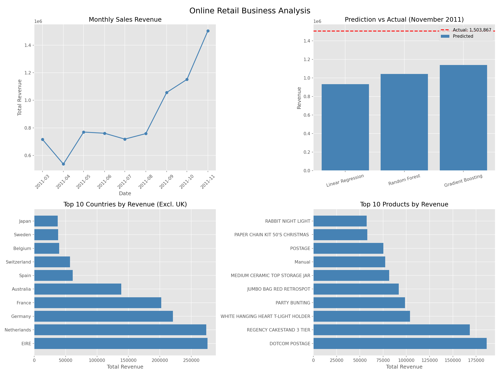
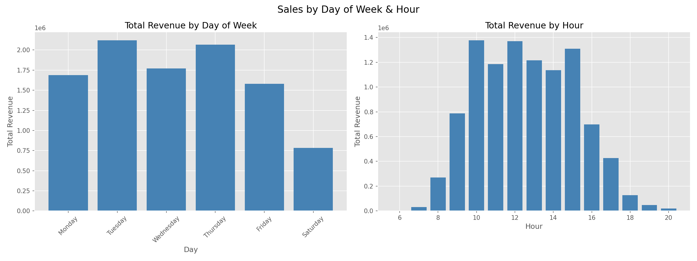
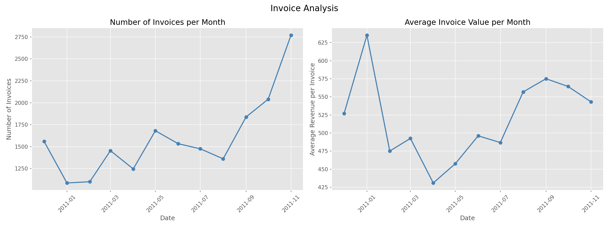

# Online Retail Sales Forecasting 🛒

A Machine Learning project to forecast monthly sales revenue for a UK-based online retail business using time series regression techniques.

---

## 📌 Project Overview

This project covers the complete machine learning workflow on real transactional data:

* Data Cleaning & Quality Control
* Exploratory Data Analysis (EDA)
* Feature Engineering & Time Series Features
* Machine Learning Model Training
* Sales Forecasting & Business Insights

---

## 📂 Dataset

The dataset is the **Online Retail Dataset** from the UCI Machine Learning Repository.

Dataset Link: https://archive.ics.uci.edu/dataset/352/online+retail

| Property | Value |
|---|---|
| Original Records | 541,909 |
| Records After Cleaning | 524,878 |
| Time Period | Dec 2010 — Nov 2011 |
| Countries | 38 |
| Problem Type | Time Series Regression |
| Target Variable | Monthly Total Revenue |

---

## 🎯 Objective

Predict monthly sales revenue for December 2011 based on historical transaction data.

---

## 🧹 Data Cleaning

| Issue | Count | Action | Reason |
|---|---|---|---|
| Missing Description | 1,454 | Removed | UnitPrice = 0 and no CustomerID |
| Negative Quantity | 9,762 | Removed | Cancellations and adjustments |
| Zero UnitPrice | 1,061 | Removed | No revenue value |
| Negative UnitPrice | 2 | Removed | Bad debt adjustments |
| Duplicate Rows | 5,226 | Removed | Exact copies |
| Incomplete Dec 2011 | 8 days only | Removed | Partial month skews forecasting |

### Cancellation Analysis

```
Negative quantity with C prefix:     9,288 (standard cancellations)
Negative quantity without C prefix:    474 (damaged goods, faulty items)
```

---

## 🔢 Feature Engineering

### New Features Created

| Feature | Formula |
|---|---|
| TotalPrice | Quantity x UnitPrice |
| Year | InvoiceDate.dt.year |
| Month | InvoiceDate.dt.month |
| Hour | InvoiceDate.dt.hour |
| DayOfWeek | InvoiceDate.dt.dayofweek |

### Time Series Lag Features

| Feature | Description |
|---|---|
| Lag1 | Revenue from 1 month ago |
| Lag2 | Revenue from 2 months ago |
| Lag3 | Revenue from 3 months ago |
| RollingMean3 | Average revenue of last 3 months |
| RollingStd3 | Revenue volatility of last 3 months |

---

## 📊 Monthly Sales Trend

| Month | Revenue |
|---|---|
| Dec 2010 | 821,452 |
| Jan 2011 | 689,811 |
| Feb 2011 | 522,545 |
| Mar 2011 | 716,215 |
| Apr 2011 | 536,968 |
| May 2011 | 769,296 |
| Jun 2011 | 760,547 |
| Jul 2011 | 718,076 |
| Aug 2011 | 757,841 |
| Sep 2011 | 1,056,435 |
| Oct 2011 | 1,151,263 |
| **Nov 2011 (Test)** | **1,503,866** |


---

## 🤖 Model Results

### Train / Test Split

| Set | Period | Records |
|---|---|---|
| Train | Mar 2011 — Oct 2011 | 8 months |
| Test | Nov 2011 | 1 month |

### Model Comparison

| Model | Predicted | Actual | MAE | R2 Train | Overfit? |
|---|---|---|---|---|---|
| Linear Regression | 933,686 | 1,503,866 | 570,180 | 0.94 | No |
| Random Forest | 1,042,927 | 1,503,866 | 460,939 | 0.87 | No |
| Gradient Boosting | 1,139,002 | 1,503,866 | 364,864 | 1.00 | Yes ⚠️ |



### December 2011 Forecast

| Model | December Forecast |
|---|---|
| Linear Regression | 785,181 |
| Random Forest | 1,042,511 |
| Gradient Boosting | 1,139,002 |

**Recommended model: Random Forest** — most balanced R2 score without overfitting.

---

## 💡 Business Insights

### Sales by Day of Week



| Finding | Insight |
|---|---|
| Tuesday & Wednesday peak | Business customers order mid-week |
| Friday drop | End of working week |
| Sunday = zero sales | Store fully closed |
| Peak hours: 10:00 — 15:00 | Business hours only |

**Conclusion: This is a B2B business** — customers are other businesses ordering during office hours.

### Invoice Analysis



| Finding | Insight |
|---|---|
| More invoices = lower avg value | New customers have smaller baskets |
| January spike in avg value | Loyal customers place large orders |
| November: 2,750 invoices | Highest volume month |

### Top Countries (Excl. UK)

Ireland, Netherlands and Germany are the top international markets after the dominant UK market.

### Key Recommendations

| Finding | Recommendation |
|---|---|
| Strong Q4 seasonality | Increase inventory from August onwards |
| Weak Q1 performance | Run promotions in January-February |
| B2B customer base | Focus marketing on business hours |
| UK market dominance | Expand to Ireland, Netherlands, Germany |
| High cancellation rate (1.8%) | Investigate and reduce return rate |

---

## ⚠️ Model Limitations

* Only 9 training months available — too few for robust forecasting
* November 2011 spike was unprecedented — no model predicted it
* Holiday season effects (Black Friday, Christmas) not fully captured
* More data needed for production-ready forecasting

---

## 📁 Project Structure

```text
online-retail-sales-forecasting/
│
├── README.md
├── requirements.txt
│
├── notebooks/
│   └── online-retail-forecasting.ipynb
│
└── images/
    ├── business_analysis.png
    ├── invoice_analysis.png
    └── day_hour_analysis.png
```

---

## 🛠️ Technologies Used

* Python 3.10
* Pandas
* NumPy
* Scikit-learn
* Matplotlib
* Jupyter Notebook

---

## ▶️ How to Run

Clone the repository:

```bash
git clone https://github.com/your-username/online-retail-sales-forecasting.git
```

Install dependencies:

```bash
pip install -r requirements.txt
```

Download the dataset from UCI and run the notebook:

```text
notebooks/online-retail-forecasting.ipynb
```

---

## 🚀 Future Improvements

* Collect more historical data (3+ years)
* Add external features (holidays, promotions, weather)
* Try ARIMA and Prophet models for time series
* Build a real-time forecasting dashboard
* Deploy as a REST API

---

## 👤 Author

Ali Abyar

Machine Learning | Data Science Project
